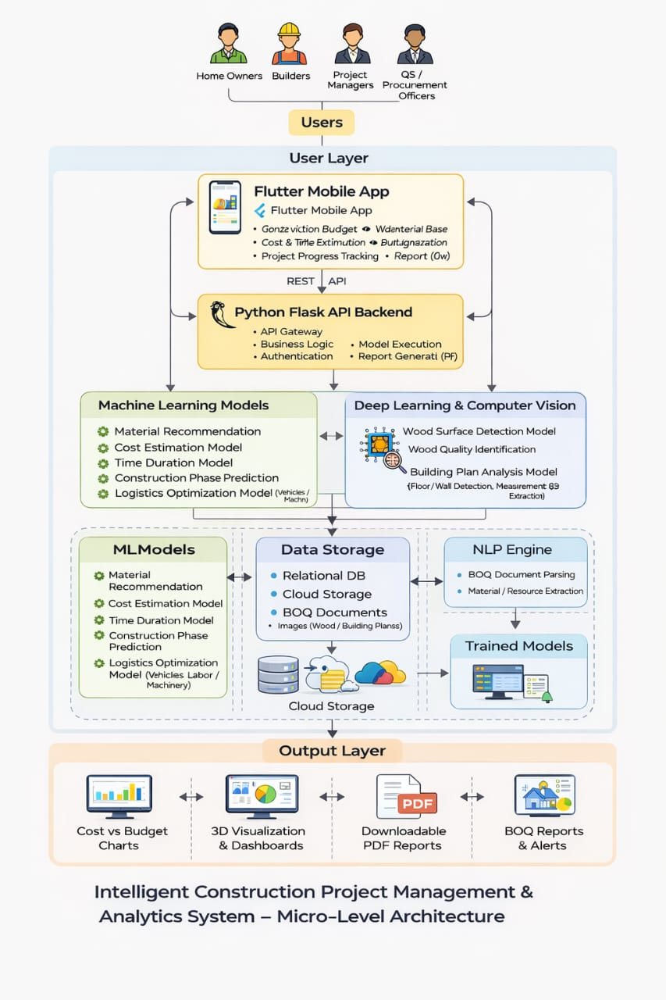

# Research Project 25/26J

Project Overview

The Intelligent Construction Project Management and Analytics System is an AI-driven platform designed to modernize and optimize construction project planning, estimation, and execution in Sri Lanka. Traditional construction practices rely heavily on manual calculations and expert judgment, which often result in cost overruns, inaccurate material estimation, project delays, and excessive material waste. This system addresses those challenges by integrating Machine Learning (ML), Deep Learning (DL), Computer Vision, and Data Analytics into a unified web and mobile-based solution.

The system consists of multiple intelligent modules that collectively support the entire construction lifecycle. These include construction material recommendation and wood quality identification, project cost and time estimation with progress tracking, building plan analysis and automated BOQ generation, and a smart logistics AI model for resource optimization. Users such as house owners, builders, quantity surveyors, and small-to-medium construction companies can input budgets, upload images or BOQ documents, and receive accurate predictions, recommendations, and visual insights.

By automating material selection, cost and duration estimation, BOQ analysis, and logistics planning, the system significantly reduces dependency on manual expertise while improving accuracy, efficiency, and sustainability. The solution is modular, scalable, and suitable for commercialization as a SaaS platform or licensed per module, making it adaptable to both local and regional construction markets.

## Project Structure

Project Dependencies

1. Software and Technology Dependencies

Frontend Technologies
Flutter (for cross-platform mobile application)
Web UI frameworks for dashboards and visualization
Backend Technologies
Python-based backend (Flask / FastAPI)
RESTful APIs for frontend–backend communication
Machine Learning & AI Libraries
Scikit-learn (ML models for prediction and recommendation)
TensorFlow / PyTorch (Deep Learning and Computer Vision models)
OpenCV (image processing and wood surface detection)
NLP Tools
PDF/Excel/Word parsers for BOQ document analysis
NLP libraries for text extraction and classification

2. Data Dependencies

Construction material datasets (wood, paint, skim coat prices and attributes)
Historical construction cost and duration data
BOQ samples and construction drawings
Labeled wood surface and quality images for model training
Logistics and resource usage data (labor, vehicles, machinery)

3. Infrastructure Dependencies

Cloud or on-premise servers for model hosting and API services
Storage systems for datasets, images, and generated reports
GPU/accelerated computing resources for training DL models
Secure database systems (MySQL / PostgreSQL / NoSQL)

4. Integration Dependencies

Integration between mobile app and backend ML services
Model versioning and deployment pipelines
PDF report generation and download services
Optional AR/3D visualization components for future extensions

5. User and Operational Dependencies

User input accuracy (budgets, measurements, images, BOQ files)
Internet connectivity for real-time predictions (with limited offline support)
Domain expertise for dataset validation and system tuning
Continuous user feedback for model improvement and usability enhancements

- `backend/`: Backend code for all components
  - `building_plan_analysis/`
  - `material_estimate/`
  - `material_recomendation_and_wood_identification/`
  - `cost_time_estimate_and_progress_tracking/`
  - `machine_management/`
- `frontend/`: Flutter frontend
  - `lib/`: Main library
    - `auth/`: Authentication related code
    - `utils/`: Utility functions
    - `widgets/`: Common widgets
    - `building_plan_analysis/`: Building plan analysis component
    - `material_estimate/`: Material estimate component
    - `wood_identification/`: Wood identification component
    - `material_recomendation/`: material recomendation component
    - `cost_time_estimate_and_progress_tracking/`: Cost,time estimate and progress tracking component
    - `machine_management/`: Machine management component

## Backend documentation & API examples 

The backend documentation and API examples are available in the repository:

- `backend/Smart_Logistics_Backend/BACKEND_DOCUMENTATION.md` — Full A→Z backend documentation, endpoints, environment, and testing instructions.
- `backend/Smart_Logistics_Backend/PREDICTION_MODEL.md` — Detailed prediction model spec, dataset headers, mappings and training results.
- `backend/Smart_Logistics_Backend/EXAMPLES.md` — Per-endpoint cURL and Python snippets for quick testing.
- `backend/Smart_Logistics_Backend/postman_collection.json` — Postman collection you can import into Postman.
- `backend/Smart_Logistics_Backend/DOCUMENTATION/openapi.json` — OpenAPI (v3) specification generated from the documentation.

Start the backend locally and view Swagger UI at `http://127.0.0.1:8000/api/docs`.
